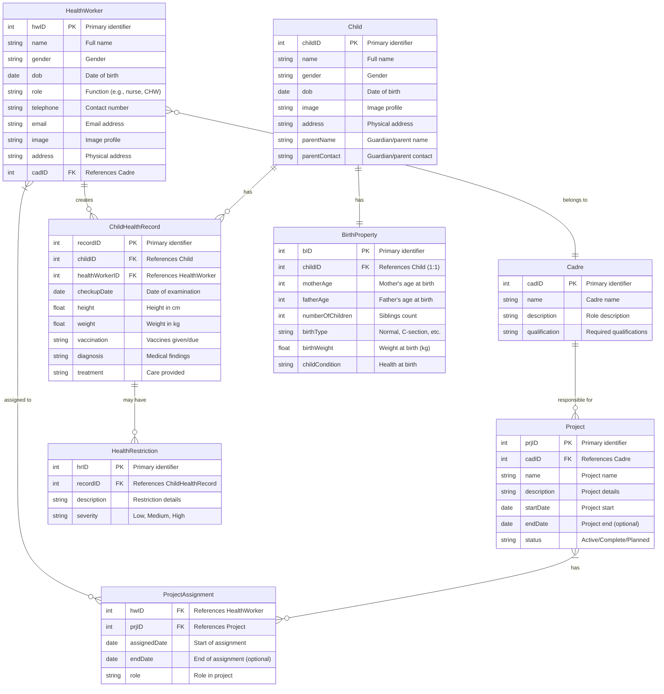

# WellnessBridge System Documentation

## Entity Relationship Diagram

## Detailed System Description

### Core Entities and Relationships

#### HealthWorker (Priority: HIGH)
- Represents healthcare professionals using the system
- One-to-many relationship with ChildHealthRecord (a worker creates many records)
- Many-to-one relationship with Cadre (many workers belong to one cadre)
- Many-to-many relationship with Project through ProjectAssignment

#### Child (Priority: HIGH)
- Central entity representing children under 5 years
- One-to-many relationship with ChildHealthRecord (a child has many health records)
- One-to-one relationship with BirthProperty (each child has exactly one birth record)

#### ChildHealthRecord (Priority: HIGH)
- Stores visit/checkup data
- Many-to-one relationship with Child (many records belong to one child)
- Many-to-one relationship with HealthWorker (many records created by one worker)
- One-to-many relationship with HealthRestriction (a record may have multiple restrictions)

#### BirthProperty (Priority: MEDIUM)
- Stores birth-related data
- One-to-one relationship with Child (each birth record belongs to exactly one child)

#### HealthRestriction (Priority: MEDIUM)
- Records health issues, allergies, or special considerations
- Many-to-one relationship with ChildHealthRecord (many restrictions can belong to one record)

#### Cadre (Priority: LOW)
- Categorizes health workers by profession or specialty
- One-to-many relationship with HealthWorker (one cadre includes many workers)
- One-to-many relationship with Project (one cadre can be responsible for many projects)

#### Project (Priority: LOW)
- Represents health initiatives or campaigns
- Many-to-one relationship with Cadre (many projects assigned to one cadre)
- Many-to-many relationship with HealthWorker through ProjectAssignment

#### ProjectAssignment (Priority: LOW)
- Junction table managing the many-to-many relationship between HealthWorker and Project
- Contains additional attributes about the assignment

### Implementation Priority

1. **First Phase** (Critical Core Functionality):
   - Child
   - HealthWorker
   - ChildHealthRecord

2. **Second Phase** (Supporting Core Functionality):
   - BirthProperty
   - HealthRestriction

3. **Third Phase** (Organizational & Administrative Features):
   - Cadre
   - Project
   - ProjectAssignment

## System Workflow

### Registration Process
1. Health worker logs into the system using their credentials
2. New children are registered with basic information
3. Birth properties are recorded during initial registration
4. Child is now in the system and ready for health tracking

### Health Check Process
1. When a child visits, health worker searches for the child's record
2. A new ChildHealthRecord is created for the current visit
3. Health metrics (height, weight, etc.) are recorded
4. Vaccinations administered are documented
5. Any diagnoses and treatments are recorded
6. Health restrictions, if any, are added to the record

### Project Management Process
1. Administrators create Cadres to organize health workers
2. Projects are created and assigned to appropriate Cadres
3. Individual health workers are assigned to projects through ProjectAssignment
4. Project progress and outcomes can be tracked through the system

### Reporting Capabilities
The system can generate various reports on:
- Child growth trends over time
- Vaccination coverage and compliance
- Prevalence of health conditions by geographic area
- Health worker activity and caseload
- Project outcomes and impact

## Database Implementation Notes

### Table Creation Priority
1. Create the independent tables first (HealthWorker, Cadre, Child, Project)
2. Create dependent tables that reference the independent tables (ChildHealthRecord, BirthProperty)
3. Create tables with multiple dependencies (HealthRestriction, ProjectAssignment)

### Key Constraints
- All FK relationships should be properly defined with appropriate ON DELETE and ON UPDATE behaviors
- The Child-BirthProperty relationship should enforce a one-to-one constraint
- The HealthWorker-Cadre relationship should not allow deletion of a Cadre if HealthWorkers are assigned to it

### Data Validation
- Age-related fields should have reasonable minimum and maximum values
- Date fields should be validated against logical ranges (e.g., birth dates can't be in the future)
- Weight and height measurements should be validated against age-appropriate ranges

## Cardinality Notation Explained

In the ERD diagram, the following cardinality notations are used:
- `||--||`: One-to-one relationship 
- `||--o{`: One-to-many relationship
- `}o--o{`: Many-to-many relationship
- `}o--||`: Many-to-one relationship

## Technical Implementation Considerations

### Database Design
- Primary keys should be auto-incrementing integers for simplicity
- Foreign key constraints should include ON DELETE and ON UPDATE actions
- Indexes should be created on frequently queried fields
- Consider adding audit fields (created_at, updated_at) to all tables

### API Layer
- RESTful endpoints should be created for each entity
- Authentication and authorization mechanisms must be implemented
- API versioning should be considered for future-proofing

### User Interface
- Role-based access control for different user types
- Mobile-friendly interface for field health workers
- Dashboards for administrators to monitor system usage and health trends
- Data visualization tools for health metrics reporting

## About Laravel

Laravel is a web application framework with expressive, elegant syntax. We believe development must be an enjoyable and creative experience to be truly fulfilling. Laravel takes the pain out of development by easing common tasks used in many web projects, such as:

- [Simple, fast routing engine](https://laravel.com/docs/routing).
- [Powerful dependency injection container](https://laravel.com/docs/container).
- Multiple back-ends for [session](https://laravel.com/docs/session) and [cache](https://laravel.com/docs/cache) storage.
- Expressive, intuitive [database ORM](https://laravel.com/docs/eloquent).
- Database agnostic [schema migrations](https://laravel.com/docs/migrations).
- [Robust background job processing](https://laravel.com/docs/queues).
- [Real-time event broadcasting](https://laravel.com/docs/broadcasting).

Laravel is accessible, powerful, and provides tools required for large, robust applications.

## Learning Laravel

Laravel has the most extensive and thorough [documentation](https://laravel.com/docs) and video tutorial library of all modern web application frameworks, making it a breeze to get started with the framework.

You may also try the [Laravel Bootcamp](https://bootcamp.laravel.com), where you will be guided through building a modern Laravel application from scratch.

If you don't feel like reading, [Laracasts](https://laracasts.com) can help. Laracasts contains thousands of video tutorials on a range of topics including Laravel, modern PHP, unit testing, and JavaScript. Boost your skills by digging into our comprehensive video library.

## Laravel Sponsors

We would like to extend our thanks to the following sponsors for funding Laravel development. If you are interested in becoming a sponsor, please visit the [Laravel Partners program](https://partners.laravel.com).

### Premium Partners

- **[Vehikl](https://vehikl.com/)**
- **[Tighten Co.](https://tighten.co)**
- **[Kirschbaum Development Group](https://kirschbaumdevelopment.com)**
- **[64 Robots](https://64robots.com)**
- **[Curotec](https://www.curotec.com/services/technologies/laravel/)**
- **[DevSquad](https://devsquad.com/hire-laravel-developers)**
- **[Redberry](https://redberry.international/laravel-development/)**
- **[Active Logic](https://activelogic.com)**

## Contributing

Thank you for considering contributing to the Laravel framework! The contribution guide can be found in the [Laravel documentation](https://laravel.com/docs/contributions).

## Code of Conduct

In order to ensure that the Laravel community is welcoming to all, please review and abide by the [Code of Conduct](https://laravel.com/docs/contributions#code-of-conduct).

## Security Vulnerabilities

If you discover a security vulnerability within Laravel, please send an e-mail to Taylor Otwell via [taylor@laravel.com](mailto:taylor@laravel.com). All security vulnerabilities will be promptly addressed.

## License

The Laravel framework is open-sourced software licensed under the [MIT license](https://opensource.org/licenses/MIT).
